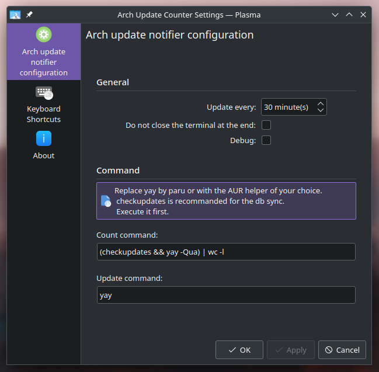

# Arch update counter - plasma widget

## Description

Counts the number of pacman update available.

Refresh each 30 minutes, on click or on the interval you set.

And you can update via the context menu or the middle click of your mouse !

Custom setting for the update command !

`new` Custom setting for the count command !

## Dependencies and AUR helper

You need to have :
 - [`pacman-contrib`](https://archlinux.org/packages/extra/x86_64/pacman-contrib/)
 - [`konsole`](https://archlinux.org/packages/extra/x86_64/konsole/)
 - `yay` is used by default for the update and the AUR count. If you want to use another AUR helper you just have to edit the command via the setting window.

`kdialog` is used too, but it's not mandatory because it's used just for alerting if `konsole` or `pacman-contrib` is not installed.

### Why `yay` and `pacman-contrib`

`pacman-contrib` provide `checkupdates` for counting the update for the `core` and `extra` repository AND it sync all the db automatically without the need of sudo.

I'have setup `yay` because I use EOS, but, you can use `paru` in the exact same way, you just have to update the command in the settings window.

### Why not just `yay -Qu` (or `paru -Qu`)

Because this command dosen't sync the DB at the same time so the result is wrong.

For that we need to do something like the `-S` flag before and I prefer to use `checkupdates` for that (it's made for it so...).

## Manual installation

Place the source (`a2n.archupdate.plasmoid` folder) in `~/.local/share/plasma/plasmoids/` or dl via [the KDE store](https://www.pling.com/p/1940819/)

## Automatic installation

Dl via the pling store or via the `get new widgets...` window.

## Configuration

| Name | Description | Result |
|--|--|--|
| Interval configuration | set the interval between each execution of the update check function | the `updater` is launch each X minutes |
| Debug | Enable the debug mode if set to true | Show each command launch by the plasmoid with `ARCHUPDATE` at the beggining (for regex search) |
| Do not close the terminal at the end | if true add the `--noclose` flag into the `konsole` command | Prevent the console to close at the end of the update command |
| Count command | The command you want to execute for counting the packages (default: `(checkupdates && yay -Qua) | wc -l`) | The updater exec this command |
| Update command | The command you want to execute when the `update` action is called | Pass the command to `konsole -e` |

### Regarding the customization of the commands

Is up to you to double check the command you want to exec.

In no case I'm responsible of anything if your system break due to your command.

The program launch the update command with `konsole -e`. So you can test your command or script with `konsole -e "my_command"`.

For the update the default command is: `konsole -e (--noclose) 'yay'` where `noclose` is optional.

## Code of conduct, license, authors, changelog, contributing

See the following file :
- [code of conduct](CODE_OF_CONDUCT.md)
- [license](LICENSE)
- [authors](AUTHORS)
- [contributing](CONTRIBUTING.md)
- [changelog](CHANGELOG)
- [security](SECURITY.md)

## Roadmap

- nothing yet, I take feature request on the go :)

## Want to participate? Have a bug or a request feature?

Do not hesitate to open a pr or an issue. I reply when I can.

## Want to support my work?

- [Give me a tips](https://ko-fi.com/a2n00)
- [Give a star on github](https://github.com/bouteillerAlan/archupdate)
- [Add a rating and a comment on Pling](https://www.pling.com/p/1940819/)
- [Become a fan on Pling](https://www.pling.com/p/1940819/)
- Or just participate to the developement :D

### Thanks !
