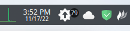

# Arch update counter - plasma widget

## Description

Counts the number of pacman update available.

Refresh each 30 minutes or on click.

## Installation

Place the source in `~/.local/share/plasma/plasmoids/` or dl via [the KDE store](https://store.kde.org/browse?cat=418&ord=latest)

## Configuration

| Name | Description | Result |
|--|--|--|
| x | x | x |

## Todo

- [ ] icon color setting
- [ ] circle & text color setting
- [ ] execute db update before the calcul

## Want to participate ?

Do not hesitate to open a mr or an issue.

