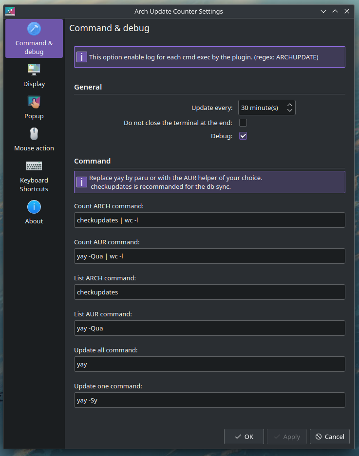

# Arch update counter - plasma widget

1 - custom icon color  |  2 - custom dot color  |  3 - default dot  |  4 - label with separator  |  5 - label without separator | 6 - in the system tray | 7 - package list

## Description

Counts the number of *aur* and *arch* update available (so all the db - extra, core, aur, ...).

Refresh each 30 minutes, on click or on the interval you set.

You can launch an update console via the context menu or the middle click of your mouse !

Custom setting for ALL the command !

You can choose between a dot or a label if an update is available.

Possibility to change the visual of the dot, the visual of the label and the visual of the icon.

A popup list all the available update.

And a lot of settings is provided for customizing all that !

## Installation

You can install the widget from :

* the KDE menu `Get New Widgets...`
* from the AUR, e.g. `yay -S kdeplasma-arch-update-notifier-git`

### Manual installation

#### Plasma 6

- place the `a2n.archupdate.plasmoid` folder from the latest release in `~/.local/share/plasma/plasmoids/`
- download via [the KDE store](https://www.pling.com/p/2134470/) (install in `~/.local/share/plasma/plasmoids/`)
- [Dl the package via the AUR](https://aur.archlinux.org/packages/kdeplasma-arch-update-notifier-git) (install in `/usr/share/plasma/plasmoids/`)

#### plasma 5

If you want to use this plugin with kde plasma 5 you should use:
 - ["The new era release" (v4.2)](https://github.com/bouteillerAlan/archupdate/releases/tag/v4.2.1)
 - [this version on the pling store](https://www.pling.com/p/1940819/)
 - [this version via the AUR](https://aur.archlinux.org/packages/kdeplasma5-arch-update-notifier-git).

**Please note that this version is not maintained since the v4.2.**

#### Dependencies and AUR helper

You need to have the following packages installed on your system **OR** to edit the settings with your prefered one:
 - [`pacman-contrib`](https://archlinux.org/packages/extra/x86_64/pacman-contrib/) is used for the list and count of the main repository.
 - [`yay`](https://github.com/Jguer/yay) is used for the list and count of the AUR repository.
 - [`konsole`](https://archlinux.org/packages/extra/x86_64/konsole/) is used to launch the cmd for the upgrade.
 - [`kdialog`](https://archlinux.org/packages/extra/x86_64/kdialog/) is used too, but it's not mandatory because it's used just for alerting if a cmd throw an error.

## How to have this in my system tray?

Go to the 'System Tray Settings' menu and activate it :)

*in some case you may need to log out / log in to see it in the list*

## Configuration

| Name | Description | Result |
|--|--|--|
| Command & Debug | | |
| Interval configuration | set the interval between each execution of the update check function | the `updater` is launch each X minutes |
| Debug | Enable the debug mode if set to true | Show each command launch by the plasmoid with `ARCHUPDATE` at the beggining (for regex search) |
| Retry | Enable the retry mode if set to true | Retry the Count or the List cmd if `stderr` is not empty |
| Do not close the terminal at the end | if true add the `--noclose` flag into the `konsole` command | Prevent the console to close at the end of the update command |
| Count ARCH command | The command you want to execute for counting the packages for CORE and EXTRA (default: `checkupdates [pipe] wc -l`) | The `updater` exec this command |
| Count AUR command | The command you want to execute for counting the packages for the other db (default: `yay -Qua [pipe] wc -l`) | The `updater` exec this command |
| Update all command | The command for updating all the package at once | Pass the command to the Terminal cmd (or the cmd with no close) |
| Update one command | The command for updating one package via the popup | Pass the command to the Terminal cmd (or the cmd with no close) and add the package name at the end |
| Terminal cmd | The command for launching the update all or one cmd | Launch the update cmd and automatically close at the end of it |
| Terminal cmd & no close | The command for launching the update all or one cmd, executed only when "Do not close at the end" is checked | Launch the update cmd and rest open at the end of it |
| Display | | |
| Show a dot in place of the label | Replace the label with a colored dot | If the total count is > than 0 the dot is visible, otherwise nothing is shown (no label, no dot) |
| Custom dot color | If you want to customize the color of the dot | If not checked the dot get the color from your theme via `PlasmaCore.Theme.textColor` |
| Separate result | If you want to have the total for *arch* and the total for the other db in the label | Set the label text to `' ' + totalArch + separator + totalAur + ' '` |
| Separator | The text you want to have for, space available | Inject the text you put into the label |
| Popup | | |
| Custom X color | You can tick the box if you want a custom color on the X element | Change the color on the popup element and on the preview in the same page |
| Separator text | Custom text for the version separator | Use the text provided to separate versions in the text |
| Mouse action | | |
| Click configuration | Choose the type of action you want to do for each click on the mouse | Left click to check, middle click to update OR Middle click to check, left click to update |
| Main action behavior | If you want to refresh the list or open the popup when you click | Main click depend on the choice made in the Click configuration settings |

### Regarding the customization of the commands

If you have any problems after modifying the default settings (especially the cmds):

*quoting the ThinkFan repo here*

> If this program steals your car, kills your horse, smokes your dope or pees on your carpet... too bad, you're on your own.

Is up to you to double check the command you want to exec. In no case I'm responsible of anything if your system break due to your command.

The program launch the update command with `konsole -e` or the cmd that you put in the setting. So you can test your command or script with `konsole -e "my_command"` or the cmd that you put in the settings `mycmd "my_command"`.

For the update command you have a demo of each cmd just between the title of the section and the setting input.

When you update all the packages the default command is: `konsole -e (--noclose) 'yay'` where `noclose` is optional.

When you update one package the default command is: `konsole -e (--noclose) 'yay -Sy' packageName` where `noclose` is optional and `packageName` is injected from the list.

## FAQ

### Why all these options for a similar command

I like to have the opportunity to really configure everything, and to do so simply.

### Why `yay` and `pacman-contrib`

`pacman-contrib` provide `checkupdates` for counting the update for the `core` and `extra` repository AND it sync all the db automatically without the need of sudo.

I'have setup `yay` because I use EOS, but, you can use `paru` in the exact same way, you just have to update the command in the settings window.

### Why not just `yay -Qu` (or `paru -Qu`)

Because this command dosen't sync the DB at the same time so the result is wrong.

For that we need to do something like the `-S` flag before and I prefer to use `checkupdates` for that (it's made for it so...).

### Why the `Do not close at the end` option when you can just update the terminal cmd

Because it's easier for people who don't want to update the default option to switch between not closing and closing the terminal at the end of the update.

### Why the update is made with yay and not pacman

Because `yay` cover all the db (core, extra, aur, ...) and `pacman` handle only core and extra.

### I want to update the PKGBUILD or the .SRCINFO for the AUR

You have to made a pr in this repository for that : [https://github.com/bouteillerAlan/kdeplasma-arch-update-notifier-git](https://github.com/bouteillerAlan/kdeplasma-arch-update-notifier-git)

## Code of conduct, license, authors, changelog, contributing

See the following file :
- [code of conduct](CODE_OF_CONDUCT.md)
- [license](LICENSE)
- [authors](AUTHORS)
- [contributing](CONTRIBUTING.md)
- [changelog](CHANGELOG)
- [security](SECURITY.md)

## Roadmap

- Nothing yet, I take feature request on the go :)

## Want to participate? Have a bug or a request feature?

Do not hesitate to open a pr or an issue. I reply when I can.

## Want to support my work?

- [Give me a tips](https://ko-fi.com/a2n00)
- [Give a star on github](https://github.com/bouteillerAlan/archupdate)
- [Add a rating and a comment on Pling](https://www.pling.com/p/2134470/)
- [Become a fan on Pling](https://www.pling.com/p/2134470/)
- Or just participate to the developement :D

### Thanks !
