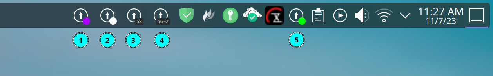

# Arch update counter - plasma widget

1 - dot w/ custom color  |  2 - dot with theme color  |  3 - label  |  4 - label with separator  |  5 - in the system tray

## Description

Counts the number of *aur* and *arch* update available (so all the db - extra, core, aur, ...).

Refresh each 30 minutes, on click or on the interval you set.

And you can launch an update console via the context menu or the middle click of your mouse !

Custom setting for the update command and for the count command !

You can choose between a dot or a label if an update is available.

Possibility to change the visual of the dot or the visual of the label.

## Dependencies and AUR helper

You need to have :
 - [`pacman-contrib`](https://archlinux.org/packages/extra/x86_64/pacman-contrib/)
 - [`konsole`](https://archlinux.org/packages/extra/x86_64/konsole/)
 - `yay` is used by default for the update and the AUR count. If you want to use another AUR helper you just have to edit the command via the setting window.

`kdialog` is used too, but it's not mandatory because it's used just for alerting if `konsole` or `pacman-contrib` is not installed.

### Why `yay` and `pacman-contrib`

`pacman-contrib` provide `checkupdates` for counting the update for the `core` and `extra` repository AND it sync all the db automatically without the need of sudo.

I'have setup `yay` because I use EOS, but, you can use `paru` in the exact same way, you just have to update the command in the settings window.

### Why not just `yay -Qu` (or `paru -Qu`)

Because this command dosen't sync the DB at the same time so the result is wrong.

For that we need to do something like the `-S` flag before and I prefer to use `checkupdates` for that (it's made for it so...).

### Why the update is made with yay and not pacman

Because `yay` cover all the db (core, extra, aur, ...) and `pacman` handle only core and extra.

## Installation

### Automatic installation

You can install the widget from the [AUR](https://aur.archlinux.org/packages/kdeplasma-arch-update-notifier-git) with `yay -S kdeplasma-arch-update-notifier-git`

Alternatively: download via the pling store or via KDEs `★ Get New Widgets...` window.

### Manual installation

Place the source (`a2n.archupdate.plasmoid` folder) in `~/.local/share/plasma/plasmoids/` or download via [the KDE store](https://www.pling.com/p/1940819/)

## How to have this in my system tray?

Go to the 'System Tray Settings' menu and activate it :)

## Configuration

| Name | Description | Result |
|--|--|--|
| Interval configuration | set the interval between each execution of the update check function | the `updater` is launch each X minutes |
| Debug | Enable the debug mode if set to true | Show each command launch by the plasmoid with `ARCHUPDATE` at the beggining (for regex search) |
| Do not close the terminal at the end | if true add the `--noclose` flag into the `konsole` command | Prevent the console to close at the end of the update command |
| Count ARCH command | The command you want to execute for counting the packages for CORE and EXTRA (default: `checkupdates [pipe] wc -l`) | The `updater` exec this command |
| Count AUR command | The command you want to execute for counting the packages for the other db (default: `yay -Qua [pipe] wc -l`) | The `updater` exec this command |
| Update command | The command you want to execute when the `update` action is called | Pass the command to `konsole -e` |
| Show a dot in place of the label | Replace the label with a colored dot | If the total count is > than 0 the dot is visible, otherwise nothing is shown (no label, no dot) |
| Custom dot color | If you want to customize the color of the dot | If not checked the dot get the color from your theme via `PlasmaCore.Theme.textColor` |
| Separate result | If you want to have the total for *arch* and the total for the other db in the label | Set the label text to `' ' + totalArch + separator + totalAur + ' '` |
| Separator | The text you want to have for, space available | Inject the text you put into the label |

### Regarding the customization of the commands

Is up to you to double check the command you want to exec.

In no case I'm responsible of anything if your system break due to your command.

The program launch the update command with `konsole -e`. So you can test your command or script with `konsole -e "my_command"`.

For the update the default command is: `konsole -e (--noclose) 'yay'` where `noclose` is optional.

## Code of conduct, license, authors, changelog, contributing

See the following file :
- [code of conduct](CODE_OF_CONDUCT.md)
- [license](LICENSE)
- [authors](AUTHORS)
- [contributing](CONTRIBUTING.md)
- [changelog](CHANGELOG)
- [security](SECURITY.md)

## Roadmap

- nothing yet, I take feature request on the go :)

## Want to participate? Have a bug or a request feature?

Do not hesitate to open a pr or an issue. I reply when I can.

## Want to support my work?

- [Give me a tips](https://ko-fi.com/a2n00)
- [Give a star on github](https://github.com/bouteillerAlan/archupdate)
- [Add a rating and a comment on Pling](https://www.pling.com/p/1940819/)
- [Become a fan on Pling](https://www.pling.com/p/1940819/)
- Or just participate to the developement :D

### Thanks !
